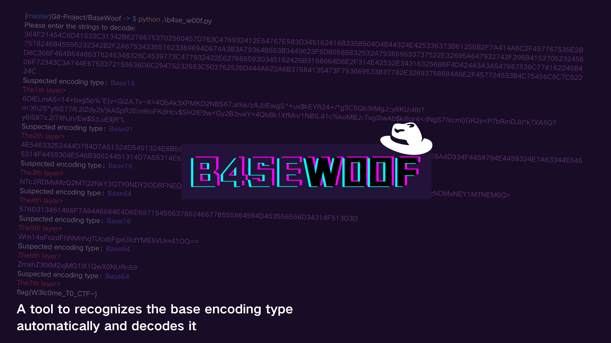

[](https://www.python.org/) [](https://github.com/Protosec-Research/AutoGDB?tab=readme-ov-file#)

## overview

For every CTFer, we may come across strings that go through many layers of Base-encoding. And if we decode it manually, it will be very troublesome!!!!Look at here! This is a tool to recognizes the base encoding type automatically and decodes it.

## Installing:

If you are new to BaseWoof, clone our project first!

Then use this command to install the "Base 91" library.

```
pip install base91
```

## Start your Cracking!

Run <u>b4se_w00f.py</u> then input the strings to decode.

This is an example.

```
python .\b4se_w00f.py
Please enter the strings to decode: ZmxhZ3tUaDFzXzFzXzRuX2V4NG1wMWV9
Suspected encoding type：Base64
The1th layer：
flag{Th1s_1s_4n_ex4mp1e}
Suspected encoding type：Base85
The2th layer：
M#[(RAJJNR
Fail to detect to type of code!
The encoding type can not been recognized or the last layer has been reached!
```

## How to develop?

Feel free to modify its code after you clone it locally!

I also sincerely appreciate your effort in reporting the bugs and enhancing the completeness of the program.

## Additional

#### If this tool has helped you, welcome to star me~

